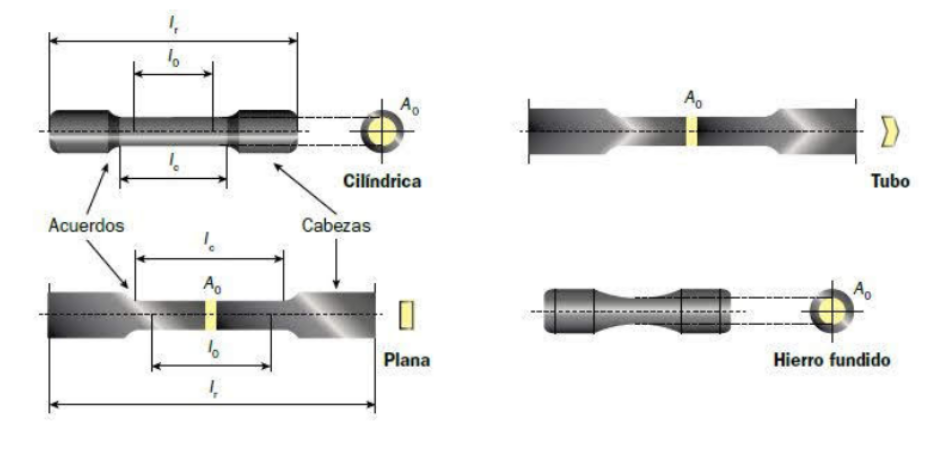
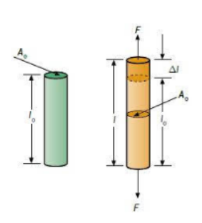
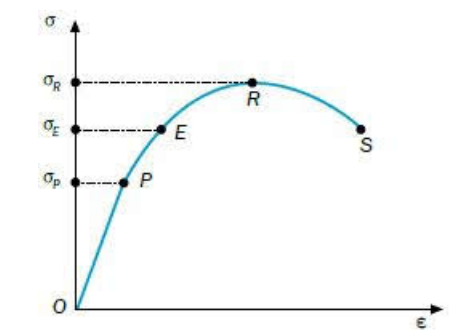
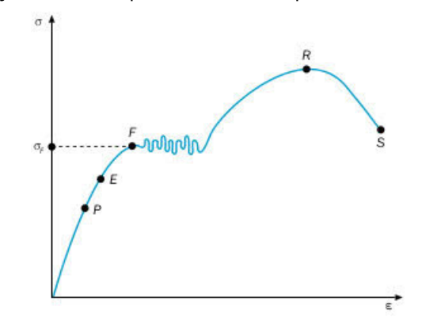

!!! portada "ENSAYO DE MATERIALES"
	Tecnología e Ingeniería 2 BACH

Tabla de contenidos
{: .toc}

[TOC]

# 1 Ensayo de tracción

Este ensayo mecánico consiste en someter a una probeta de forma y dimensiones normalizadas a un sistema de fuerzas exteriores (esfuerzo de tracción) en la dirección de su eje longitudinal hasta romperla.

## 1.1 Deformaciones elásticas y plásticas

Cuando sometemos un material a una tensión, se deforma. Si al cesar la fuerza el material recupera sus dimensiones primitivas, se dice que ha experimentado una deformación elástica.

Si el material se deforma hasta el extremo de no poder recuperar por completo sus medidas originales, se dice que ha experimentado una deformación plástica.

{.center style="width: 70%"}

## 1.2 Tensión y deformación
Consideremos una varilla cilíndrica de longitud $L_0$ y una sección $A_0$, sometida a una tensión $F$ de tracción.

{.center style="width: 30%"}

Definiremos **tensión ($\sigma$)** como el cociente entre la fuerza de tracción $F$ y la sección transversal $A_0$ de la varilla:
$$\sigma = \frac{F}{A_0}$$

La unidad de tensión en el Sistema Internacional es el pascal: $1 \text{ Pa} = 1 \text{ N/m}^2$.

Cuando se aplica a una varilla una fuerza de tracción, se provoca un alargamiento o elongación de esta en la dirección de la fuerza. Este desplazamiento se llama deformación.

## 1.3 Análisis de un diagrama de tracción
Los resultados obtenidos en la realización de un ensayo de tracción se representan en una gráfica de tal manera que obtenemos una curva que relaciona las tensiones con las deformaciones relativas a la longitud inicial, llamadas alargamientos unitarios.

{.center style="width: 50%"}

Al estudiar este diagrama, podemos distinguir dos zonas fundamentales:

*   **Zona elástica (OE).** Se caracteriza por que al cesar las tensiones aplicadas, los materiales recuperan su longitud original $l_0$.
    *   **Zona de proporcionalidad (OP).** Se trata de una recta, por lo que existe una proporcionalidad entre las tensiones aplicadas y los alargamientos unitarios. Es la zona donde deben trabajar los materiales. Matemáticamente se cumple la Ley de Hooke.
    *   **Zona no proporcional (PE).** El material se comporta de forma elástica, pero las deformaciones y tensiones no están relacionadas linealmente. No es una zona aconsejable para trabajar los materiales.
*   **Zona plástica (ES).** Se ha rebasado la tensión del límite elástico $\sigma_E$ de forma que, aunque dejemos de aplicar tensiones de tracción, el material ya no recupera su longitud original. El material ha sufrido deformaciones permanentes.
    *   **Zona límite de rotura (ER).** Zona de comportamiento muy similar a la anterior, donde a pequeñas variaciones de tensión se producen grandes alargamientos. El límite es el punto R (**límite de rotura**).
    *   **Zona de rotura (RS).** Superado el punto R, el material sigue alargándose progresivamente hasta que se produce la rotura física total en el punto S.

**Fenómeno de fluencia:** En algunos materiales como el acero, existe una zona por encima del límite elástico donde se produce un alargamiento muy rápido sin que varíe la tensión aplicada. El punto donde comienza se llama **límite de fluencia (F)**.

{.center style="width: 50%"}

## 1.4 Ley de Hooke
Las tensiones aplicadas sobre un elemento resistente son directamente proporcionales a las deformaciones producidas, dentro del comportamiento elástico de los materiales.
$$\sigma = E \cdot \varepsilon$$

En esta representación, el valor de la pendiente se conoce como **módulo elástico o módulo de Young (E)**. Representa la rigidez del material. Se mide en $\text{kp/cm}^2$, $\text{kp/mm}^2$ o $\text{N/m}^2$ (Pascales).

# 2. Ensayos de dureza
La dureza es la resistencia que ofrece un material a ser rayado o penetrado por otro. La propiedad mecánica que se determina es la **cohesión**. Los ensayos de penetración se basan en forzar un penetrador sobre la superficie y medir la huella resultante.

## 2.1 Ensayo Brinell
Consiste en comprimir una bola de acero templado de diámetro $D$ contra el material mediante una carga $F$.

La dureza Brinell ($HB$) se calcula como:
$$HB = \frac{F}{S}$$
Donde $S$ es el área del casquete de la huella. Operando con el diámetro de la huella ($d$), la fórmula final es:
$$HB = \frac{2F}{\pi D (D - \sqrt{D^2 - d^2})}$$

*   **Condiciones:** Se usa para materiales gruesos (> 6 mm). Las cargas deben ser proporcionales al diámetro: $F = K \cdot D^2$. La constante $K$ depende del material.

## 2.2 Ensayo Vickers
El penetrador es una **pirámide regular de base cuadrada** con un ángulo entre caras de 136°.

Se usa para materiales muy duros (superiores a 500 HB) o espesores muy pequeños (hasta 0,05 mm).
$$HV = \frac{1,8544 \cdot F}{d^2}$$
Donde $d$ es la diagonal de la huella en mm.

## 2.3 Ensayo Rockwell
A diferencia de los anteriores, mide la **profundidad de la huella ($e$)**, no su área.

*   **Rockwell B (HRB):** Penetrador de bola de acero (materiales blandos).
*   **Rockwell C (HRC):** Penetrador de cono de diamante de 120° (materiales duros).

**Pasos:**
1. Precarga de 10 kp ($h_1$).
2. Carga total ($h_2$).
3. Vuelta a precarga ($h_3$).
4. El valor de $e$ es la diferencia de profundidad: $e = \frac{h_3 - h_1}{0,002}$.

Fórmulas de dureza:
*   $HRC = 100 - e$
*   $HRB = 130 - e$

# 3. Ensayo Charpy
Es un ensayo de flexión por choque para calcular la **resiliencia**, que es la resistencia a la rotura por impacto brusco.

Consiste en golpear una probeta entallada con un péndulo que cae desde una altura $H$. La energía absorbida en el impacto ($W$) se calcula por la diferencia de alturas del péndulo:
$$W = P \cdot (H - h)$$
La resiliencia ($\rho$ o $K_{cu}$) es la energía por unidad de sección ($S$):
$$\rho = \frac{W}{S}$$
